# VocabMastery 架构与流程图

> 配套纯前端英语单词学习系统的可视化文档。所有 Mermaid 流程图可在 VS Code / Typora / GitHub / Trae IDE 中实时渲染。

---

## 1. 系统总架构(12 模块 + 数据层)

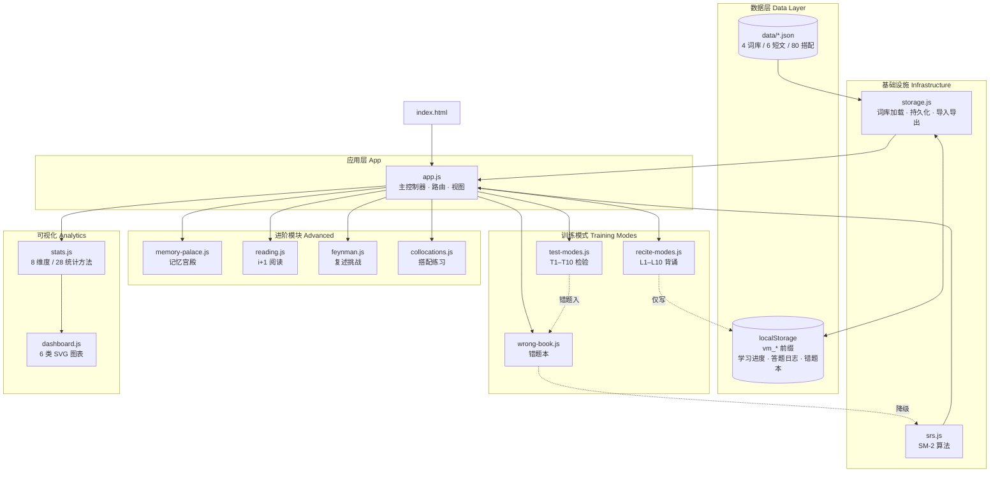
```mermaid
graph TB
  subgraph "数据层 Data Layer"
    JSON[("data/*.json<br/>4 词库 / 6 短文 / 80 搭配")]
    LS[("localStorage<br/>vm_* 前缀<br/>学习进度 · 答题日志 · 错题本")]
  end

  subgraph "基础设施 Infrastructure"
    Storage["storage.js<br/>词库加载 · 持久化 · 导入导出"]
    SRS["srs.js<br/>SM-2 算法"]
  end

  subgraph "训练模式 Training Modes"
    Recite["recite-modes.js<br/>L1–L10 背诵"]
    Test["test-modes.js<br/>T1–T10 检验"]
    Wrong["wrong-book.js<br/>错题本"]
  end

  subgraph "进阶模块 Advanced"
    Palace["memory-palace.js<br/>记忆宫殿"]
    Read["reading.js<br/>i+1 阅读"]
    Feynman["feynman.js<br/>复述挑战"]
    Colloc["collocations.js<br/>搭配练习"]
  end

  subgraph "可视化 Analytics"
    Stats["stats.js<br/>8 维度 / 28 统计方法"]
    Dash["dashboard.js<br/>6 类 SVG 图表"]
  end

  subgraph "应用层 App"
    App["app.js<br/>主控制器 · 路由 · 视图"]
  end

  HTML[index.html]

  JSON --> Storage
  Storage <--> LS
  SRS --> App

  App --> Recite
  App --> Test
  App --> Wrong
  App --> Palace
  App --> Read
  App --> Feynman
  App --> Colloc
  App --> Stats
  Stats --> Dash

  Recite -.仅写.-> LS
  Test -.错题入.-> Wrong
  Wrong -.降级.-> SRS
  Storage --> App

  HTML --> App
```

**关键设计**:
- **背诵模式只写 attempts_log,不污染 SRS 主队列** → 主动回忆训练不影响间隔重复节奏
- **错题自动入 SRS 高优先级**(`lapses+1`, `interval=1`)→ 检验发现的薄弱点 1 天后必复习
- **数据层与训练层解耦** → Storage 是唯一与 localStorage 交互的模块

---

## 2. 用户学习闭环(6 步循环)

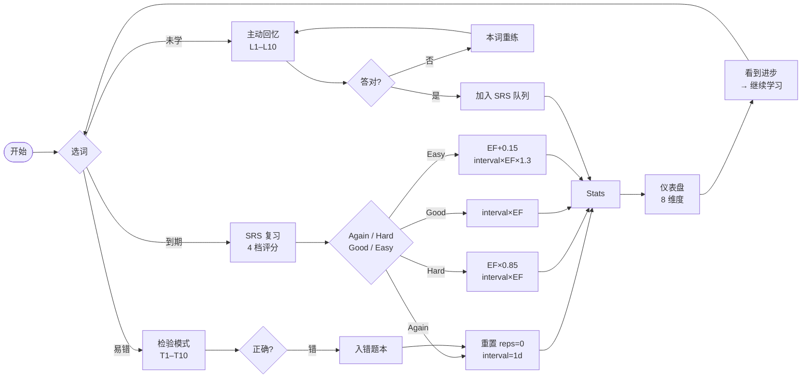
```mermaid
flowchart LR
  Start([开始]) --> Pick{选词}
  Pick -->|未学| Learn[主动回忆<br/>L1–L10]
  Pick -->|到期| Review[SRS 复习<br/>4 档评分]
  Pick -->|易错| Test[检验模式<br/>T1–T10]

  Learn --> Feedback{答对?}
  Review --> Score{Again / Hard<br/>Good / Easy}
  Test --> Result{正确?}

  Feedback -->|是| New[加入 SRS 队列]
  Feedback -->|否| Retry[本词重练]
  Retry --> Learn

  Score -->|Again| Reset[重置 reps=0<br/>interval=1d]
  Score -->|Hard| Half[EF×0.85<br/>interval×EF]
  Score -->|Good| Norm[interval×EF]
  Score -->|Easy| Boost[EF+0.15<br/>interval×EF×1.3]

  Reset --> Stats
  Half --> Stats
  Norm --> Stats
  Boost --> Stats

  Result -->|错| Wrong[入错题本]
  Wrong --> Reset

  New --> Stats
  Stats --> Dash[仪表盘<br/>8 维度]
  Dash --> Insight[看到进步<br/>→ 继续学习]
  Insight --> Pick
```

---

## 3. SM-2 算法流程(SuperMemo)

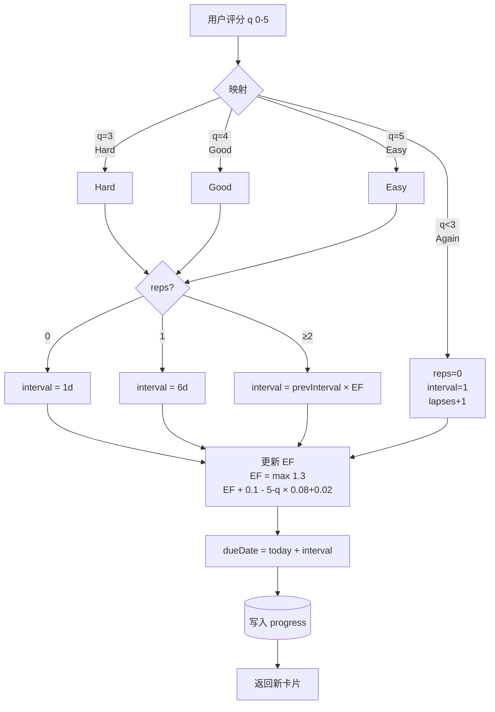
```mermaid
flowchart TB
  Input[用户评分 q 0-5] --> Map{映射}

  Map -->|q<3<br/>Again| Fail[reps=0<br/>interval=1<br/>lapses+1]
  Map -->|q=3<br/>Hard| Hard
  Map -->|q=4<br/>Good| Good
  Map -->|q=5<br/>Easy| Easy

  Hard --> CheckR{reps?}
  Good --> CheckR
  Easy --> CheckR

  CheckR -->|0| Int1[interval = 1d]
  CheckR -->|1| Int2[interval = 6d]
  CheckR -->|≥2| Int3[interval = prevInterval × EF]

  Int1 --> EF
  Int2 --> EF
  Int3 --> EF
  Fail --> EF[更新 EF<br/>EF = max 1.3<br/>EF + 0.1 - 5-q × 0.08+0.02]

  EF --> Due[dueDate = today + interval]
  Due --> Save[(写入 progress)]
  Save --> Next[返回新卡片]
```

**SM-2 间隔阶梯**(q=Good 连续正确): 1d → 6d → 15d → 37d → 92d → 230d

---

## 4. 8 维度统计仪表盘


```mermaid
graph TB
  Root[📊 统计仪表盘]

  Root --> D1[维度 1<br/>词汇量]
  Root --> D2[维度 2<br/>正确率]
  Root --> D3[维度 3<br/>理解率]
  Root --> D4[维度 4<br/>发音]
  Root --> D5[维度 5<br/>记忆持久度]
  Root --> D6[维度 6<br/>效率]
  Root --> D7[维度 7<br/>错题]
  Root --> D8[维度 8<br/>进度]

  D1 --> D1a[总词数]
  D1 --> D1b[已学/已掌握]
  D1 --> D1c[阶段进度 4×%]

  D2 --> D2a[整体正确率]
  D2 --> D2b[初一细粒度]
  D2 --> D2c[题型雷达]
  D2 --> D2d[主题柱状]

  D3 --> D3a[释义/语境]
  D3 --> D3b[词族/搭配]

  D4 --> D4a[发音均分]
  D4 --> D4b[易错 Top10]

  D5 --> D5a[EF 均值]
  D5 --> D5b[预测遗忘]
  D5 --> D5c[记忆曲线]

  D6 --> D6a[日均量]
  D6 --> D6b[热力图 365d]
  D6 --> D6c[Streak]

  D7 --> D7a[易错 Top20]
  D7 --> D7b[易混淆对]
  D7 --> D7c[键盘热力]

  D8 --> D8a[四阶段进度]
  D8 --> D8b[30 天曲线]
  D8 --> D8c[遗忘曲线]
```

**总计**: 8 维度 / 30+ 指标 / 6 类 SVG 图表

---

## 5. 背诵模式 vs 检验模式 对比

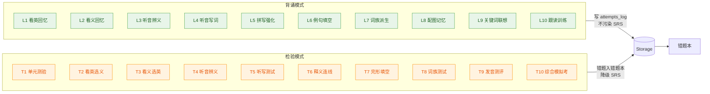
```mermaid
flowchart LR
  subgraph 背诵模式
    L1[L1 看英回忆]:::recite
    L2[L2 看义回忆]:::recite
    L3[L3 听音辨义]:::recite
    L4[L4 听音写词]:::recite
    L5[L5 拼写强化]:::recite
    L6[L6 例句填空]:::recite
    L7[L7 词族派生]:::recite
    L8[L8 配图记忆]:::recite
    L9[L9 关键词联想]:::recite
    L10[L10 跟读训练]:::recite
  end

  subgraph 检验模式
    T1[T1 单元测验]:::test
    T2[T2 看英选义]:::test
    T3[T3 看义选英]:::test
    T4[T4 听音辨义]:::test
    T5[T5 听写测试]:::test
    T6[T6 释义连线]:::test
    T7[T7 完形填空]:::test
    T8[T8 词族测试]:::test
    T9[T9 发音测评]:::test
    T10[T10 综合模拟考]:::test
  end

  背诵模式 -->|写 attempts_log<br/>不污染 SRS| Storage[(Storage)]
  检验模式 -->|错题入错题本<br/>降级 SRS| Storage
  Storage --> WrongBook[错题本]

  classDef recite fill:#e8f5e9,stroke:#43a047,color:#1b5e20
  classDef test fill:#fff3e0,stroke:#fb8c00,color:#e65100
```

**关键差异**:

| 维度 | 背诵模式 | 检验模式 |
|------|---------|---------|
| 目标 | 输入 · 巩固 | 测评 · 找薄弱 |
| SRS 影响 | **不污染**主队列 | 错题**降级**到 1d |
| 题型 | 主动回忆 / 拼写 / 跟读 | 选择 / 填空 / 模拟考 |
| 反馈 | 实时 | 完成后报告 |
| 频次 | 高(每日 30-60 词) | 低(每周 1-2 次测验) |

---

## 6. 数据流(从点击到 localStorage)

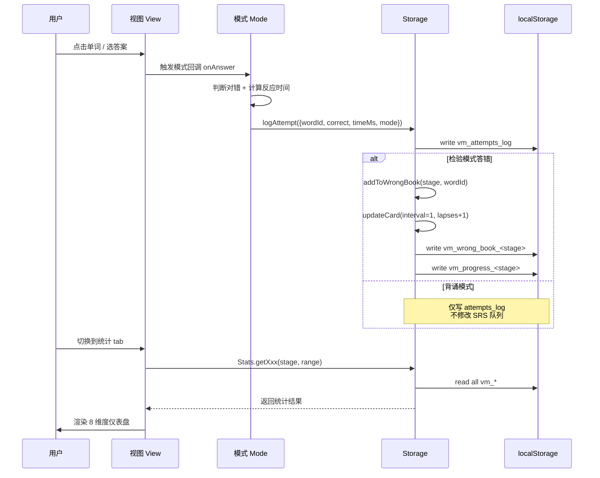
```mermaid
sequenceDiagram
  participant U as 用户
  participant V as 视图 View
  participant M as 模式 Mode
  participant S as Storage
  participant LS as localStorage

  U->>V: 点击单词 / 选答案
  V->>M: 触发模式回调 onAnswer
  M->>M: 判断对错 + 计算反应时间
  M->>S: logAttempt({wordId, correct, timeMs, mode})
  S->>LS: write vm_attempts_log

  alt 检验模式答错
    S->>S: addToWrongBook(stage, wordId)
    S->>S: updateCard(interval=1, lapses+1)
    S->>LS: write vm_wrong_book_<stage>
    S->>LS: write vm_progress_<stage>
  else 背诵模式
    Note over S,LS: 仅写 attempts_log<br/>不修改 SRS 队列
  end

  U->>V: 切换到统计 tab
  V->>S: Stats.getXxx(stage, range)
  S->>LS: read all vm_*
  S-->>V: 返回统计结果
  V->>U: 渲染 8 维度仪表盘
```

---

## 7. 错题本流转

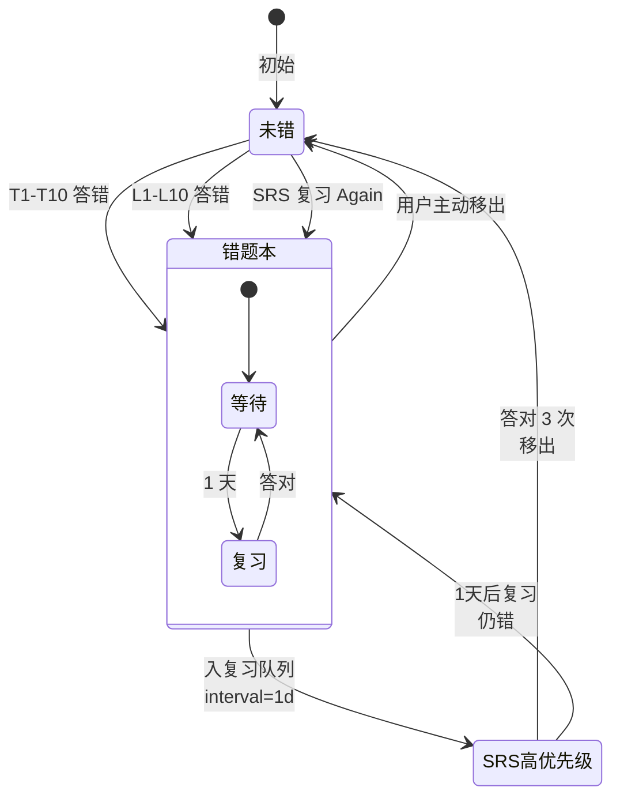
```mermaid
stateDiagram-v2
  [*] --> 未错: 初始

  未错 --> 错题本: T1-T10 答错
  未错 --> 错题本: L1-L10 答错
  未错 --> 错题本: SRS 复习 Again

  错题本 --> SRS高优先级: 入复习队列<br/>interval=1d
  SRS高优先级 --> 错题本: 1天后复习<br/>仍错
  SRS高优先级 --> 未错: 答对 3 次<br/>移出
  错题本 --> 未错: 用户主动移出

  state 错题本 {
    [*] --> 等待
    等待 --> 复习: 1 天
    复习 --> 等待: 答对
  }
```

---

## 8. 四阶段学习路径

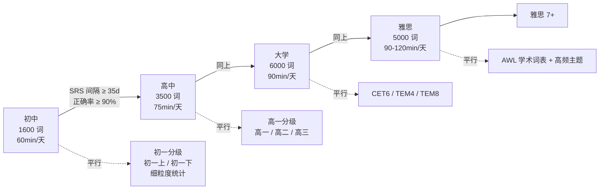
```mermaid
graph LR
  A[初中<br/>1600 词<br/>60min/天] -->|SRS 间隔 ≥ 35d<br/>正确率 ≥ 90%| B[高中<br/>3500 词<br/>75min/天]
  B -->|同上| C[大学<br/>6000 词<br/>90min/天]
  C -->|同上| D[雅思<br/>5000 词<br/>90-120min/天]
  D --> E[雅思 7+]

  A -. 平行 .-> A2[初一分级<br/>初一上 / 初一下<br/>细粒度统计]
  B -. 平行 .-> B2[高一分级<br/>高一 / 高二 / 高三]
  C -. 平行 .-> C2[CET6 / TEM4 / TEM8]
  D -. 平行 .-> D2[AWL 学术词表 + 高频主题]
```

---

## 9. 6 类图表清单

| 图表类 | 用途 | 出现位置 |
|--------|------|---------|
| 柱状图 | 阶段进度 / 主题正确率 / 题型正确率 | 维度 1 / 2 |
| 折线图 | 30 天学习曲线 / 记忆曲线 / 遗忘曲线 | 维度 5 / 6 / 8 |
| 雷达图 | 题型掌握度 / 主题覆盖 | 维度 2 / 8 |
| 热力图 | 365 天学习日历 / QWERTY 拼写错误 | 维度 6 / 7 |
| 进度环 | 总进度 / 4 阶段进度 | 主页 / 维度 1 |
| statCard | 数字指标(总词数 / 已学 / 正确率) | 全部维度 |

---

## 10. 部署架构

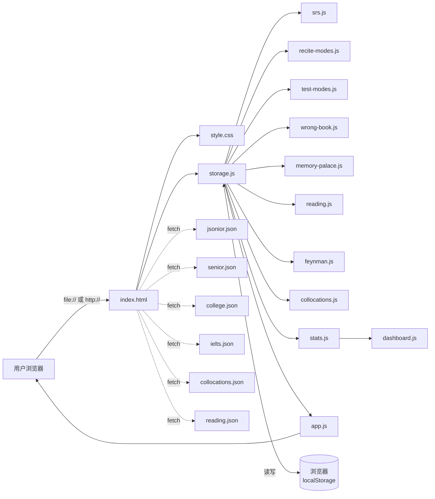
```mermaid
graph LR
  User[用户浏览器] -->|file:// 或 http://| HTML[index.html]
  HTML --> CSS[style.css]
  HTML --> JS1[storage.js]
  JS1 --> JS2[srs.js]
  JS1 --> JS3[recite-modes.js]
  JS1 --> JS4[test-modes.js]
  JS1 --> JS5[wrong-book.js]
  JS1 --> JS6[memory-palace.js]
  JS1 --> JS7[reading.js]
  JS1 --> JS8[feynman.js]
  JS1 --> JS9[collocations.js]
  JS1 --> JS10[stats.js]
  JS10 --> JS11[dashboard.js]
  JS1 --> JS12[app.js]

  JS12 --> User

  HTML -. fetch .-> JSON1[jsonior.json]
  HTML -. fetch .-> JSON2[senior.json]
  HTML -. fetch .-> JSON3[college.json]
  HTML -. fetch .-> JSON4[ielts.json]
  HTML -. fetch .-> JSON5[collocations.json]
  HTML -. fetch .-> JSON6[reading.json]

  JS1 <-->|读写| LS[(浏览器<br/>localStorage)]
```

**特点**:
- **零后端**: 所有数据存 localStorage
- **跨刷新**: 学习进度不丢
- **可备份**: 一键导出 JSON 即可换设备

---

## 11. 10 种背诵模式 (L1–L10) 详细交互流

每个模式都是「主动回忆」训练,核心流程:**呈现刺激 → 用户思考 → 自我评估 → 写 attempts_log**。以下逐一展示交互时序与界面布局。

### 11.1 L1 · 看英回忆 (View English → Recall Chinese)

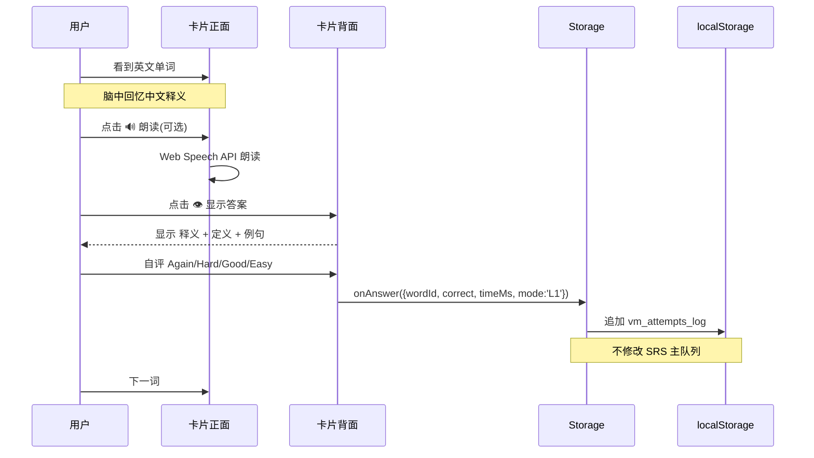
```mermaid
sequenceDiagram
  participant U as 用户
  participant V as 卡片正面
  participant V2 as 卡片背面
  participant S as Storage
  participant LS as localStorage

  U->>V: 看到英文单词
  Note over U,V: 脑中回忆中文释义
  U->>V: 点击 🔊 朗读(可选)
  V->>V: Web Speech API 朗读
  U->>V2: 点击 👁 显示答案
  V2-->>U: 显示 释义 + 定义 + 例句
  U->>V2: 自评 Again/Hard/Good/Easy
  V2->>S: onAnswer({wordId, correct, timeMs, mode:'L1'})
  S->>LS: 追加 vm_attempts_log
  Note over S,LS: 不修改 SRS 主队列
  U->>V: 下一词
```

**界面布局**:
```
┌──────────────────────────────────────┐
│  L1 看英回忆       3 / 20   [返回]   │
├──────────────────────────────────────┤
│  ╔════════════════════════════════╗  │
│  ║                                ║  │
│  ║         photograph             ║  │
│  ║         /fəˈtɒɡrɑːf/            ║  │
│  ║         n.                     ║  │
│  ║                                ║  │
│  ║   (点击下方"显示答案"对照)     ║  │
│  ║                                ║  │
│  ╚════════════════════════════════╝  │
│                                      │
│    [🔊 朗读]      [👁 显示答案]      │
└──────────────────────────────────────┘
```

---

### 11.2 L2 · 看义回忆 (View Chinese → Type English)

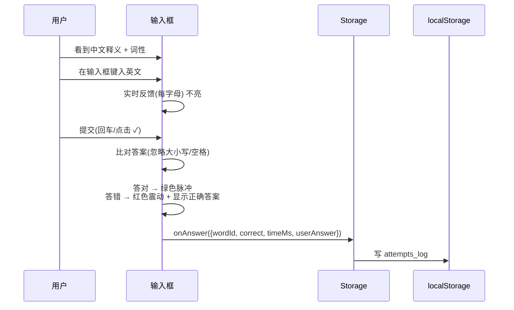
```mermaid
sequenceDiagram
  participant U as 用户
  participant V as 输入框
  participant S as Storage
  participant LS as localStorage

  U->>V: 看到中文释义 + 词性
  U->>V: 在输入框键入英文
  V->>V: 实时反馈(每字母) 不亮
  U->>V: 提交(回车/点击 ✓)
  V->>V: 比对答案(忽略大小写/空格)
  V->>V: 答对 → 绿色脉冲<br/>答错 → 红色震动 + 显示正确答案
  V->>S: onAnswer({wordId, correct, timeMs, userAnswer})
  S->>LS: 写 attempts_log
```

**界面布局**:
```
┌──────────────────────────────────────┐
│  L2 看义回忆       5 / 20            │
├──────────────────────────────────────┤
│  ╔════════════════════════════════╗  │
│  ║       n. 照片,相片              ║  │
│  ║       /fəˈtɒɡrɑːf/             ║  │
│  ╚════════════════════════════════╝  │
│                                      │
│  ┌──────────────────────────────┐    │
│  │  p h o t o g r a p h _ _ _   │    │  ← 实时输入
│  └──────────────────────────────┘    │
│                                      │
│       [⏎ 提交]   [👁 显示答案]      │
└──────────────────────────────────────┘
```

---

### 11.3 L3 · 听音辨义 (Listen → Pick Translation)

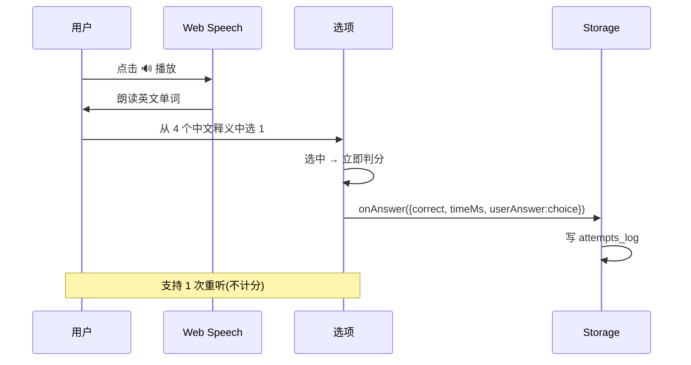
```mermaid
sequenceDiagram
  participant U as 用户
  participant TTS as Web Speech
  participant V as 选项
  participant S as Storage

  U->>TTS: 点击 🔊 播放
  TTS->>U: 朗读英文单词
  U->>V: 从 4 个中文释义中选 1
  V->>V: 选中 → 立即判分
  V->>S: onAnswer({correct, timeMs, userAnswer:choice})
  S->>S: 写 attempts_log
  Note over U,V: 支持 1 次重听(不计分)
```

**界面布局**:
```
┌──────────────────────────────────────┐
│  L3 听音辨义       8 / 20            │
├──────────────────────────────────────┤
│                                      │
│            🔊                        │
│         (大喇叭图标)                 │
│                                      │
│      [点击播放发音]                  │
│                                      │
├──────────────────────────────────────┤
│   ┌──────────┐  ┌──────────┐         │
│   │ A. 照片  │  │ B. 电话  │         │
│   └──────────┘  └──────────┘         │
│   ┌──────────┐  ┌──────────┐         │
│   │ C. 电视  │  │ D. 相机  │         │
│   └──────────┘  └──────────┘         │
└──────────────────────────────────────┘
```

---

### 11.4 L4 · 听音写词 (Listen → Type Word)

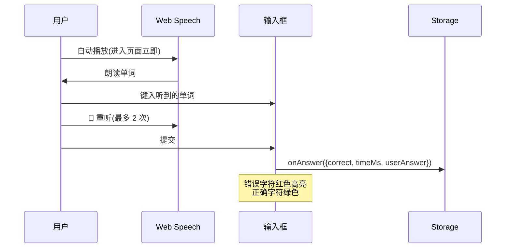
```mermaid
sequenceDiagram
  participant U as 用户
  participant TTS as Web Speech
  participant V as 输入框
  participant S as Storage

  U->>TTS: 自动播放(进入页面立即)
  TTS->>U: 朗读单词
  U->>V: 键入听到的单词
  U->>TTS: 🔁 重听(最多 2 次)
  U->>V: 提交
  V->>S: onAnswer({correct, timeMs, userAnswer})
  Note over V: 错误字符红色高亮<br/>正确字符绿色
```

**界面布局**:
```
┌──────────────────────────────────────┐
│  L4 听音写词       12 / 20           │
├──────────────────────────────────────┤
│            🔊 🔁                     │
│         (播放/重听)                  │
│                                      │
│  提示:n. / 复数形式                  │
│                                      │
│  ┌──────────────────────────────┐    │
│  │  p h o t o g r a p _          │    │  ← 实时反馈
│  └──────────────────────────────┘    │
│                                      │
│        [⏎ 提交]                      │
└──────────────────────────────────────┘
```

---

### 11.5 L5 · 拼写强化 (Letter-by-Letter Feedback)

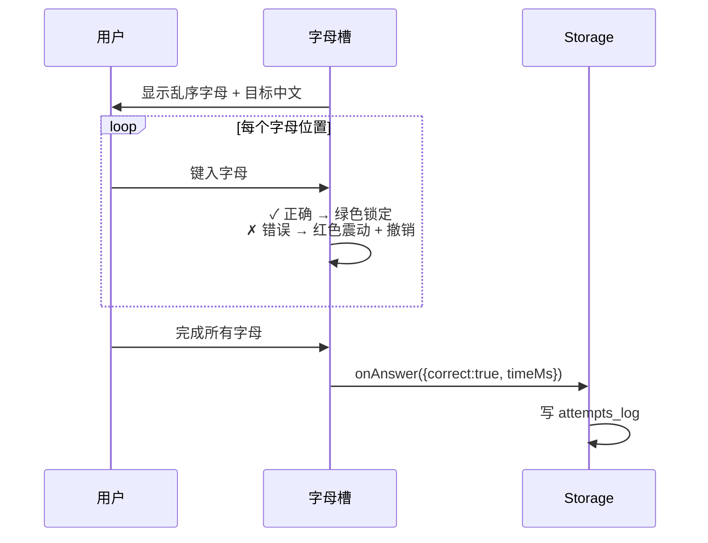
```mermaid
sequenceDiagram
  participant U as 用户
  participant V as 字母槽
  participant S as Storage

  V->>U: 显示乱序字母 + 目标中文
  loop 每个字母位置
    U->>V: 键入字母
    V->>V: ✓ 正确 → 绿色锁定<br/>✗ 错误 → 红色震动 + 撤销
  end
  U->>V: 完成所有字母
  V->>S: onAnswer({correct:true, timeMs})
  S->>S: 写 attempts_log
```

**界面布局**:
```
┌──────────────────────────────────────┐
│  L5 拼写强化       7 / 20            │
├──────────────────────────────────────┤
│     n. 照片                          │
│                                      │
│  ┌─┐┌─┐┌─┐┌─┐┌─┐┌─┐┌─┐┌─┐┌─┐┌─┐    │
│  │p││h││o││t││o││g││r││a││p││h│    │  ← 10 个输入槽
│  └─┘└─┘└─┘└─┘└─┘└─┘└─┘└─┘└─┘└─┘    │
│                                      │
│  候选字母池:                          │
│  [o] [g] [p] [h] [t] [a] [r] [...]  │  ← 拖拽或点击
│                                      │
└──────────────────────────────────────┘
```

---

### 11.6 L6 · 例句填空 (Cloze from Context)

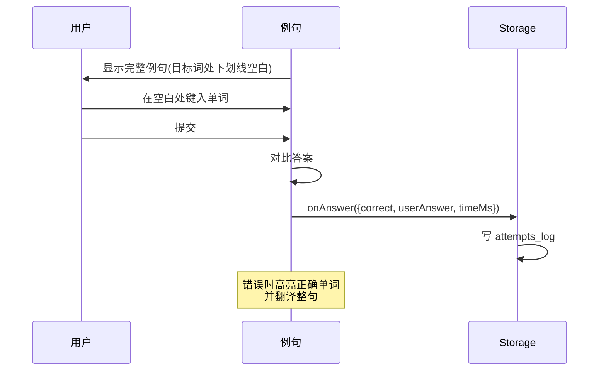
```mermaid
sequenceDiagram
  participant U as 用户
  participant V as 例句
  participant S as Storage

  V->>U: 显示完整例句(目标词处下划线空白)
  U->>V: 在空白处键入单词
  U->>V: 提交
  V->>V: 对比答案
  V->>S: onAnswer({correct, userAnswer, timeMs})
  S->>S: 写 attempts_log
  Note over V: 错误时高亮正确单词<br/>并翻译整句
```

**界面布局**:
```
┌──────────────────────────────────────┐
│  L6 例句填空       15 / 20           │
├──────────────────────────────────────┤
│  I took a beautiful _________       │
│  of the sunset yesterday.            │
│                                      │
│  提示:n. / 10 字母                   │
│                                      │
│  ┌──────────────────────────────┐    │
│  │  p h o t o g r a p h         │    │
│  └──────────────────────────────┘    │
│                                      │
│        [⏎ 提交]                      │
└──────────────────────────────────────┘
```

---

### 11.7 L7 · 词族派生 (Word Family)

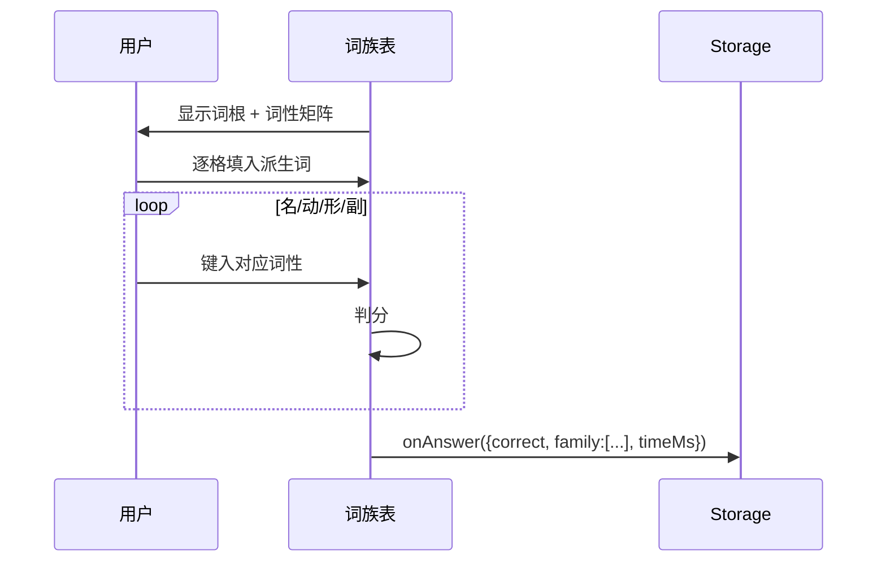
```mermaid
sequenceDiagram
  participant U as 用户
  participant V as 词族表
  participant S as Storage

  V->>U: 显示词根 + 词性矩阵
  U->>V: 逐格填入派生词
  loop 名/动/形/副
    U->>V: 键入对应词性
    V->>V: 判分
  end
  V->>S: onAnswer({correct, family:[...], timeMs})
```

**界面布局**:
```
┌──────────────────────────────────────┐
│  L7 词族派生       4 / 20            │
├──────────────────────────────────────┤
│       photograph (n.)                │
│                                      │
│  ┌──────────┬────────────────┐      │
│  │  词性    │  派生词        │      │
│  ├──────────┼────────────────┤      │
│  │  n.      │  photograph    │      │
│  │  v.      │  ____________  │      │  ← 待填
│  │  adj.    │  photographic  │      │
│  │  adv.    │  ____________  │      │  ← 待填
│  │  n.人    │  photographer  │      │
│  └──────────┴────────────────┘      │
│                                      │
│        [⏎ 提交]                      │
└──────────────────────────────────────┘
```

---

### 11.8 L8 · 配图记忆 (Image ↔ Word Pairing)

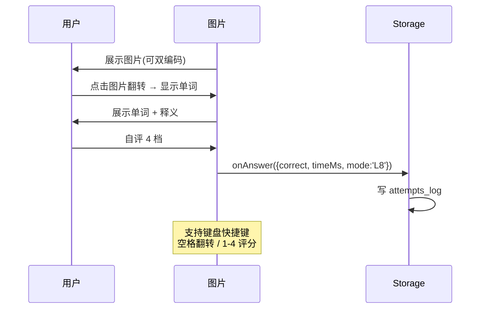
```mermaid
sequenceDiagram
  participant U as 用户
  participant V as 图片
  participant S as Storage

  V->>U: 展示图片(可双编码)
  U->>V: 点击图片翻转 → 显示单词
  V->>U: 展示单词 + 释义
  U->>V: 自评 4 档
  V->>S: onAnswer({correct, timeMs, mode:'L8'})
  S->>S: 写 attempts_log
  Note over V: 支持键盘快捷键<br/>空格翻转 / 1-4 评分
```

**界面布局**:
```
┌──────────────────────────────────────┐
│  L8 配图记忆       9 / 20            │
├──────────────────────────────────────┤
│  ╔════════════════════════════════╗  │
│  ║                                ║  │
│  ║                                ║  │
│  ║     [📷 摄影师拍照图]          ║  │
│  ║                                ║  │
│  ║                                ║  │
│  ║       (空格翻转)               ║  │
│  ╚════════════════════════════════╝  │
│                                      │
│  [Again] [Hard] [Good] [Easy]        │
└──────────────────────────────────────┘
```

---

### 11.9 L9 · 关键词+联想图 (Keyword + Mind Map)

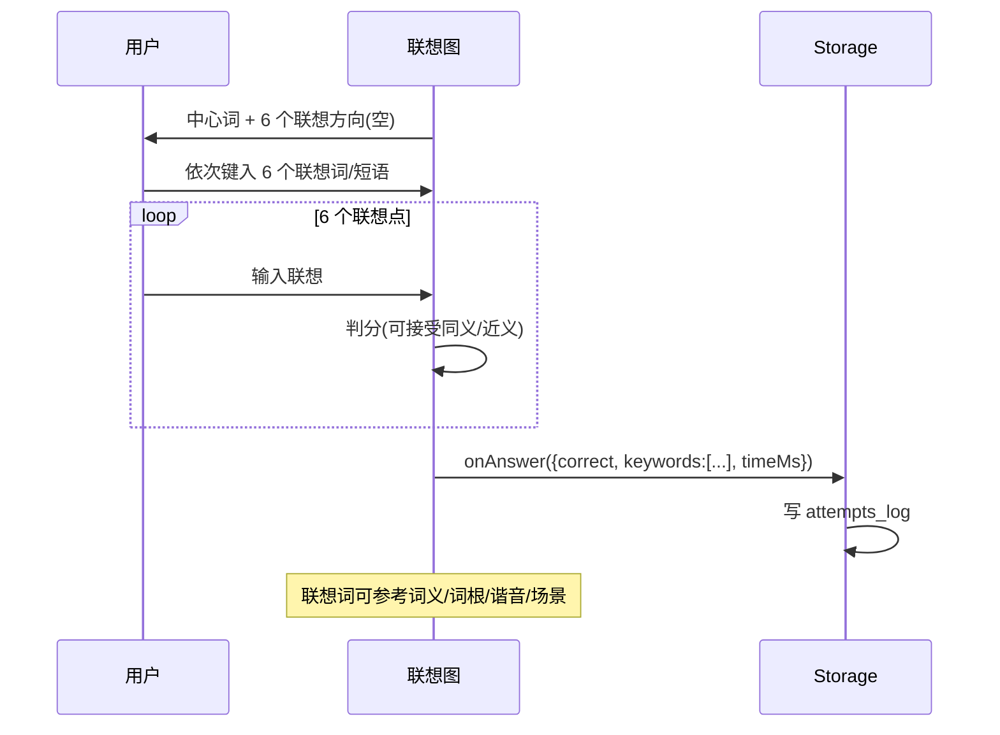
```mermaid
sequenceDiagram
  participant U as 用户
  participant V as 联想图
  participant S as Storage

  V->>U: 中心词 + 6 个联想方向(空)
  U->>V: 依次键入 6 个联想词/短语
  loop 6 个联想点
    U->>V: 输入联想
    V->>V: 判分(可接受同义/近义)
  end
  V->>S: onAnswer({correct, keywords:[...], timeMs})
  S->>S: 写 attempts_log
  Note over V: 联想词可参考词义/词根/谐音/场景
```

**界面布局**:
```
┌──────────────────────────────────────┐
│  L9 关键词+联想图  6 / 20            │
├──────────────────────────────────────┤
│              [联想1]                 │
│                 ↘                    │
│   [联想2] →   📷photograph  ← [联想3]│
│                 ↗                    │
│              [联想4]                 │
│                                      │
│  [联想5]                          [联想6] │
│                                      │
│  提示:拍照场景/谐音/词根             │
│  ┌──────────────────────────────┐    │
│  │  ________________________    │    │  ← 当前编辑框
│  └──────────────────────────────┘    │
└──────────────────────────────────────┘
```

---

### 11.10 L10 · 跟读训练 (TTS + Recording + Scoring)

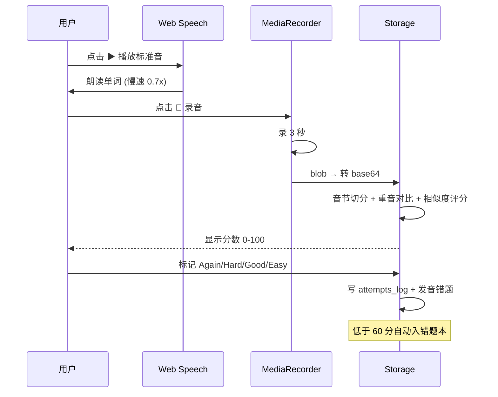
```mermaid
sequenceDiagram
  participant U as 用户
  participant TTS as Web Speech
  participant MIC as MediaRecorder
  participant S as Storage

  U->>TTS: 点击 ▶ 播放标准音
  TTS->>U: 朗读单词 (慢速 0.7x)
  U->>MIC: 点击 🎤 录音
  MIC->>MIC: 录 3 秒
  MIC->>S: blob → 转 base64
  S->>S: 音节切分 + 重音对比 + 相似度评分
  S-->>U: 显示分数 0-100
  U->>S: 标记 Again/Hard/Good/Easy
  S->>S: 写 attempts_log + 发音错题
  Note over S: 低于 60 分自动入错题本
```

**界面布局**:
```
┌──────────────────────────────────────┐
│  L10 跟读训练      11 / 20           │
├──────────────────────────────────────┤
│                                      │
│           photograph                 │
│           /fəˈtɒɡrɑːf/                │
│                                      │
│    [▶ 标准音]    [🔁 慢速 0.7x]      │
│                                      │
│           ┌─────────┐                │
│           │  🎤     │                │  ← 录音按钮(脉冲动画)
│           │ 录音中  │                │
│           └─────────┘                │
│                                      │
│    评分: 85 / 100                    │
│    ████████████████░░░░              │
│    音节 ✓ ✓ 重音 ✗                   │
│                                      │
│  [Again] [Hard] [Good] [Easy]        │
└──────────────────────────────────────┘
```

---

## 12. 8 维度仪表盘布局 (Layout Wireframe)

仪表盘采用 **CSS Grid** + **glassmorphism 卡片**,每行 2-3 张卡片,响应式自适应。

### 12.1 整体布局

```
┌────────────────────────────────────────────────────────────────┐
│  📊 学习仪表盘      [阶段: 初中 ▾]  [时间: 近30天 ▾]           │
├────────────────────────────────────────────────────────────────┤
│  ╔══════════════════════════════════════════════════════════╗  │
│  ║ 维度 1 · 词汇量统计                                       ║  │
│  ╠═══════════════════╦═══════════════════╦══════════════════╣  │
│  ║ 总词数            ║ 已学 / 已掌握     ║ 当前阶段进度环   ║  │
│  ║ 1,600             ║ 856 / 432         ║  🟢 53%          ║  │
│  ╚═══════════════════╩═══════════════════╩══════════════════╝  │
│  ╔══════════════════════════════════════════════════════════╗  │
│  ║ 1.6 各阶段进度条                                          ║  │
│  ║  初中 ████████░░ 80%  │ 高中 ██░░░░░░░ 20%               ║  │
│  ║  大学 ░░░░░░░░░░  0%  │ 雅思 ░░░░░░░░░░  0%               ║  │
│  ╚══════════════════════════════════════════════════════════╝  │
│                                                                │
│  ╔══════════════════════════════════════════════════════════╗  │
│  ║ 维度 2 · 正确率细分                                       ║  │
│  ╠══════════════╦══════════════╦══════════════╦═════════════╣  │
│  ║ 2.1 整体     ║ 2.2 当前阶段 ║ 2.3 各年级   ║ 2.4 趋势    ║  │
│  ║ 82.5%        ║ 85.3%        ║ [柱状图]     ║ [折线]      ║  │
│  ╠══════════════╩══════════════╩══════════════╩═════════════╣  │
│  ║ 2.5 题型正确率雷达图          │  2.6 主题正确率柱状图       ║  │
│  ║   [六边形雷达]                │   [横向柱状]                ║  │
│  ╚═══════════════════════════════╧══════════════════════════╝  │
│                                                                │
│  ╔══════════════════════════════════════════════════════════╗  │
│  ║ 维度 3 · 理解率 (语义层面)                                ║  │
│  ╠══════════════╦══════════════╦════════════════════════════╣  │
│  ║ 3.1 释义理解  ║ 3.2 语境理解 ║ 3.3 词族理解                ║  │
│  ║ 88%           ║ 79%          ║ 73%                         ║  │
│  ╚══════════════╩══════════════╩════════════════════════════╝  │
│                                                                │
│  ╔══════════════════════════════════════════════════════════╗  │
│  ║ 维度 4 · 发音正确率                                       ║  │
│  ╠══════════════╦══════════════╦════════════════════════════╣  │
│  ║ 4.1 平均分    ║ 4.2 音节     ║ 4.3 重音                    ║  │
│  ║ 78/100        ║ 92%          ║ 71%                         ║  │
│  ╠══════════════╩══════════════╩════════════════════════════╣  │
│  ║ 4.4 易错发音 Top 10 列表                                   ║  │
│  ║   1. photograph  65分  2. schedule  68分 ...               ║  │
│  ╚══════════════════════════════════════════════════════════╝  │
│                                                                │
│  ╔══════════════════════════════════════════════════════════╗  │
│  ║ 维度 5 · 记忆持久度                                       ║  │
│  ╠══════════════╦══════════════╦════════════════════════════╣  │
│  ║ 5.1 EF 均值   ║ 5.2 预测遗忘 ║ 5.3 记忆曲线                ║  │
│  ║ 2.45          ║ 14 词/7天    ║ [S 形曲线]                  ║  │
│  ╚══════════════╩══════════════╩════════════════════════════╝  │
│                                                                │
│  ╔══════════════════════════════════════════════════════════╗  │
│  ║ 维度 6 · 效率指标                                         ║  │
│  ╠══════════════╦══════════════╦════════════════════════════╣  │
│  ║ 6.1 日均量    ║ 6.2 Streak   ║ 6.3 最快/最慢               ║  │
│  ║ 32 词/天      ║ 🔥 15 天     ║ 1.2s / 8.5s                 ║  │
│  ╠══════════════╩══════════════╩════════════════════════════╣  │
│  ║ 6.4 365 天学习热力图 (53 周 × 7 天 网格)                  ║  │
│  ║   ▪▪▫▫▪▪▪  ▫▪▪▪▪▪▪▪  ...                                 ║  │
│  ╚══════════════════════════════════════════════════════════╝  │
│                                                                │
│  ╔══════════════════════════════════════════════════════════╗  │
│  ║ 维度 7 · 错题分析                                         ║  │
│  ╠══════════════╦══════════════╦════════════════════════════╣  │
│  ║ 7.1 错题总量  ║ 7.2 易错 Top20│ 7.3 易混淆对               ║  │
│  ║ 128 次        ║ [列表]       ║ affect/effect 23次         ║  │
│  ╠══════════════╩══════════════╩════════════════════════════╣  │
│  ║ 7.4 QWERTY 键盘拼写错误热力图                             ║  │
│  ║   Q W E R T Y U I O P                                      ║  │
│  ║    A S D F G H J K L                                       ║  │
│  ║     Z X C V B N M                                          ║  │
│  ╚══════════════════════════════════════════════════════════╝  │
│                                                                │
│  ╔══════════════════════════════════════════════════════════╗  │
│  ║ 维度 8 · 阶段进度                                         ║  │
│  ╠══════════════════════════════════════════════════════════╣  │
│  ║ 8.1 四阶段进度条 (横向大条)                                ║  │
│  ║  初中 ████████░░ 80% (1,280/1,600)                        ║  │
│  ║  高中 ██░░░░░░░░ 20% (700/3,500)                          ║  │
│  ║  大学 ░░░░░░░░░░  0% (0/6,000)                            ║  │
│  ║  雅思 ░░░░░░░░░░  0% (0/5,000)                            ║  │
│  ╠══════════════════════════════════════════════════════════╣  │
│  ║ 8.2 30 天学习曲线  │  8.3 遗忘曲线 (Ebbinghaus)           ║  │
│  ║   [折线]            │   [指数衰减曲线]                     ║  │
│  ╚══════════════════════════════════════════════════════════╝  │
└────────────────────────────────────────────────────────────────┘
```

### 12.2 卡片内部组件类型

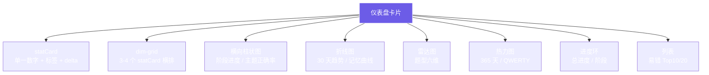
```mermaid
graph TB
  Card[仪表盘卡片]:::root
  Card --> Stat[statCard<br/>单一数字 + 标签 + delta]
  Card --> Grid[dim-grid<br/>3-4 个 statCard 横排]
  Card --> Bar[横向柱状图<br/>阶段进度 / 主题正确率]
  Card --> Line[折线图<br/>30 天趋势 / 记忆曲线]
  Card --> Radar[雷达图<br/>题型六维]
  Card --> Heatmap[热力图<br/>365 天 / QWERTY]
  Card --> Ring[进度环<br/>总进度 / 阶段]
  Card --> List[列表<br/>易错 Top10/20]

  classDef root fill:#6c5ce7,stroke:#fff,color:#fff
```

### 12.3 配色与视觉规范

| 元素 | 颜色 | 用途 |
|------|------|------|
| 主色 Primary | `#6c5ce7` 紫 | 卡片边框 / 进度填充 / 主标题 |
| 辅色 Secondary | `#00b894` 绿 | 正确 / 完成 / 已掌握 |
| 强调 Accent | `#fdcb6e` 黄 | 中等 / 进行中 |
| 警告 Warning | `#ffa502` 橙 | Hard / 需注意 |
| 危险 Danger | `#ff7675` 红 | 错误 / 易错 / Again |
| 静默 Muted | `rgba(255,255,255,0.45)` | 未学 / 占位 |
| 背景 | 玻璃拟态 glassmorphism | `backdrop-filter: blur(20px)` + 半透白 |

### 12.4 响应式断点

| 断点 | 宽度 | 布局 |
|------|------|------|
| 桌面 Desktop | ≥ 1200px | 3-4 列卡片网格 |
| 笔记本 Laptop | 768-1199px | 2-3 列 |
| 平板 Tablet | 480-767px | 1-2 列,雷达图缩小 |
| 手机 Mobile | < 480px | 单列堆叠,热力图横向滚动 |

### 12.5 数据加载时序

```mermaid
sequenceDiagram
  participant U as 用户
  participant V as 仪表盘视图
  participant D as Dashboard
  participant St as Stats
  participant S as Storage
  participant LS as localStorage

  U->>V: 切换到"统计" tab
  V->>D: render(stage, range)
  D->>St: getVocabulary(stage)
  D->>St: getAccuracy(stage, range)
  D->>St: getComprehension(stage, range)
  D->>St: getPronunciation(stage, range)
  D->>St: getRetention(stage)
  D->>St: getEfficiency(stage, range)
  D->>St: getWrongBook(stage)
  D->>St: getProgress(stage, range)
  par 并行读取 8 个维度
    St->>S: readProgress(stage)
    S->>LS: getItem(vm_progress_*)
  and
    St->>S: readAttempts(range)
    S->>LS: getItem(vm_attempts_log)
  and
    St->>S: readWrongBook(stage)
    S->>LS: getItem(vm_wrong_book_*)
  end
  St-->>D: 8 维度数据
  D->>D: 渲染 6 类 SVG 图表
  D-->>V: DOM 节点
  V-->>U: 8 维度仪表盘
```

**总计**: 8 维度 / 30+ 指标 / 6 类 SVG 图表 / 4 种响应式断点。
